<div align="center">

# 👋 Hi, I'm Nabil Khossossi


</div>

---

<div align="center">

### 🔬 Postdoc @ DIFFER | 🎓 Guest Researcher @ TU Delft

[](https://sustai-nabil.com/)
[](https://scholar.google.com)
[](https://linkedin.com/in/YOUR-PROFILE)
[](https://orcid.org/YOUR-ID)

</div>

---

## 🚀 What I Do

```python
class MaterialsScientist:
    def __init__(self):
        self.name = "Nabil Khossossi"
        self.role = "AI4Mat Researcher"
        self.location = "Netherlands 🇳🇱"
        
    def expertise(self):
        return {
            "AI": ["Neural Networks", "Active Learning", "Graph ML"],
            "DFT": ["VASP", "Quantum Espresso", "High-throughput"],
            "Focus": ["Photovoltaics", "2D Materials", "Catalysts"]
        }
```

---

## ⚡ Tech Stack

<div align="center">


</div>

<div align="center">

| DFT Codes | ML Frameworks | Materials Tools |
|:---------:|:-------------:|:---------------:|
| 🔮 VASP | 🧠 PyTorch | ⚗️ ASE |
| ⚛️ Quantum Espresso | 🤖 scikit-learn | 🔬 Pymatgen |
| 🌊 GPAW | 📊 TensorFlow | 📈 Materials Project |

</div>

---

## 📊 GitHub Stats

<div align="center">


</div>

<div align="center">

[](https://git.io/streak-stats)

</div>

---

## 🎯 Current Projects

<table align="center">
<tr>
<td width="50%">

### 🤖 AI4Mat Framework
**Physics-informed ML for materials**
- 🔬 DFT + Neural Networks
- ⚡ Active Learning Loop
- 🎯 Pareto Optimization

[](https://github.com/NabKh)

</td>
<td width="50%">

### 🔐 Quantum Cryptography
**Neural surrogates for CV-QKD**
- 🧠 Replace expensive calculations
- ⚡ 1000× speedup
- 🎯 Target: Nature Comms

[](https://github.com/NabKh)

</td>
</tr>
</table>

---

## 🏆 Research Highlights

```mermaid
graph LR
    A[🔬 DFT Calculations] -->|Machine Learning| B[🧠 Property Prediction]
    B -->|Active Learning| C[⚡ New Materials]
    C -->|Validation| A
    C -->|Best Candidates| D[🎯 Experimental Testing]
    style A fill:#58A6FF,stroke:#1F6FEB,color:#fff
    style B fill:#58A6FF,stroke:#1F6FEB,color:#fff
    style C fill:#58A6FF,stroke:#1F6FEB,color:#fff
    style D fill:#238636,stroke:#1A7F37,color:#fff
```

<div align="center">



</div>

---

## 🎓 Featured Repositories

<div align="center">

<a href="https://github.com/NabKh/Quantum_Espresso_Tutorials">
  
</a>

<a href="https://github.com/NabKh/VASP-Tools">
  
</a>

</div>

---

## 📈 Contribution Graph

<div align="center">

[](https://github.com/NabKh)

</div>

---

## 🌟 Skills Radar

<div align="center">


</div>

---

## 🎨 Workflow Visualization

```mermaid
%%{init: {'theme':'dark'}}%%
flowchart LR
    A[💡 Hypothesis] --> B[🔬 DFT Simulation]
    B --> C{📊 Analysis}
    C -->|Promising| D[🤖 ML Training]
    C -->|Need More| B
    D --> E[🎯 Discovery]
    E --> F[📄 Publication]
    style A fill:#DA3633,stroke:#D1242F,color:#fff
    style B fill:#58A6FF,stroke:#1F6FEB,color:#fff
    style C fill:#58A6FF,stroke:#1F6FEB,color:#fff
    style D fill:#58A6FF,stroke:#1F6FEB,color:#fff
    style E fill:#238636,stroke:#1A7F37,color:#fff
    style F fill:#F778BA,stroke:#BF3989,color:#fff
```

<div align="center">



</div>

---

## 🤝 Let's Connect!

<div align="center">

**🔍 Looking for:** Faculty Positions | Research Collaborations | AI4Materials Projects


### 💌 Reach Out

[](mailto:your.email@differ.nl)
[](https://sustai-nabil.com)
[](https://twitter.com/YOUR-HANDLE)

</div>

---

<div align="center">

### ⚡ *"Accelerating materials discovery with AI"* ⚡


</div>
